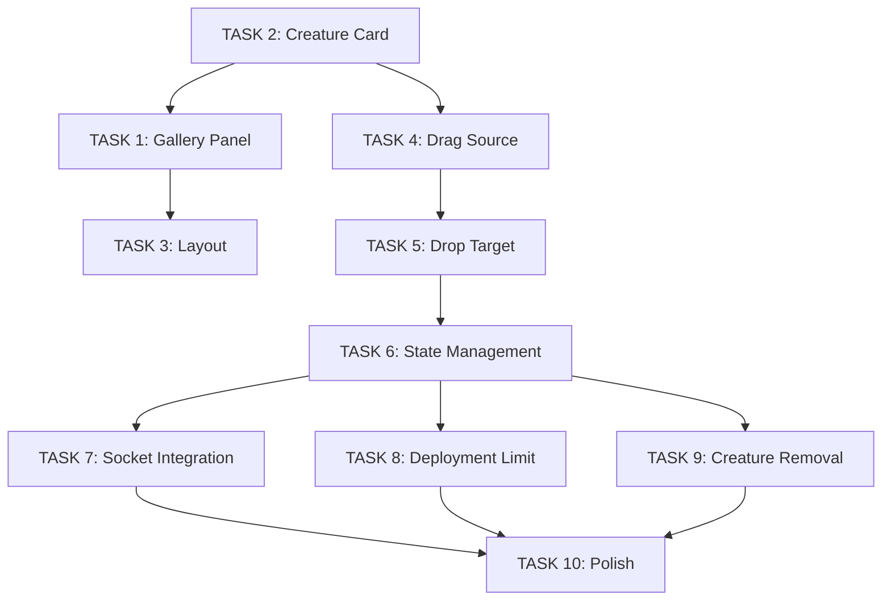

# L4 Tasks: Gallery-Based Creature Selection in Deployment

**Parent Feature**: Gallery-Based Creature Selection in Deployment (L3)
**Epic**: Battle Deployment System (L2)
**Status**: Ready for Implementation
**Created**: 2025-10-26

## Task Breakdown Summary

Total Tasks: 10
Estimated Time: 16-20 hours
Complexity: High

## Implementation Order

```
Phase 1: UI Components (Tasks 1-3)
  └─> Phase 2: Drag & Drop (Tasks 4-5)
      └─> Phase 3: State Management (Tasks 6-7)
          └─> Phase 4: Limits & Validation (Tasks 8-9)
              └─> Phase 5: Polish (Task 10)
```

---

## TASK 1: Create Gallery Panel Component

**ID**: `TASK-GBCS-1`
**Type**: Frontend Component
**Priority**: High
**Estimated Time**: 2 hours
**Dependencies**: None

### Description
Create a sidebar component that displays the player's creature gallery during deployment.

### Acceptance Criteria
- [ ] Component: `<GalleryPanel ownerId={string} onCreatureSelect={fn} />`
- [ ] Fetches creatures with `libraryService.listCreatures(ownerId)`
- [ ] Displays creatures in grid layout (2 columns)
- [ ] Each card shows: 64x64 sprite, creature name
- [ ] Supports pagination (load 24, scroll to load more)
- [ ] Shows loading skeleton during fetch
- [ ] Shows "No creatures" empty state

### Implementation Details

**File**: `/frontend/src/components/GalleryPanel/GalleryPanel.tsx`

```typescript
interface GalleryPanelProps {
  ownerId: 'demo-player1' | 'demo-player2';
  onCreatureSelect: (creature: SerializedCreatureDocument) => void;
  deployedCreatureIds: Set<string>;
  maxDeployment: number;
  deployedCount: number;
}

export function GalleryPanel({
  ownerId,
  onCreatureSelect,
  deployedCreatureIds,
  maxDeployment,
  deployedCount
}: GalleryPanelProps) {
  const [creatures, setCreatures] = useState<SerializedCreatureDocument[]>([]);
  const [loading, setLoading] = useState(true);
  const [offset, setOffset] = useState(0);
  const [hasMore, setHasMore] = useState(true);

  useEffect(() => {
    loadCreatures();
  }, [ownerId, offset]);

  const loadCreatures = async () => {
    setLoading(true);
    const response = await libraryService.listCreatures(ownerId, 24, offset);
    setCreatures(prev => [...prev, ...response.creatures]);
    setHasMore(response.hasMore);
    setLoading(false);
  };

  const atLimit = deployedCount >= maxDeployment;

  return (
    <div className="gallery-panel">
      <header>
        <h2>Your Creatures</h2>
        <span>{deployedCount} / {maxDeployment} deployed</span>
      </header>

      <div className="gallery-grid">
        {creatures.map(creature => (
          <CreatureCard
            key={creature.id}
            creature={creature}
            onSelect={() => onCreatureSelect(creature)}
            disabled={atLimit || deployedCreatureIds.has(creature.id)}
            deployed={deployedCreatureIds.has(creature.id)}
          />
        ))}
      </div>

      {loading && <LoadingSkeleton />}
      {!loading && creatures.length === 0 && <EmptyState />}
      {hasMore && <button onClick={() => setOffset(offset + 24)}>Load More</button>}
    </div>
  );
}
```

### Test Cases

**Component Tests** (`GalleryPanel.test.tsx`):
1. ✓ Fetches creatures on mount with correct ownerId
2. ✓ Displays creatures in grid layout
3. ✓ Shows loading skeleton during fetch
4. ✓ Shows empty state when no creatures
5. ✓ Loads more on button click
6. ✓ Calls onCreatureSelect when card clicked
7. ✓ Disables cards when at deployment limit
8. ✓ Shows deployed indicator for deployed creatures

---

## TASK 2: Create Creature Card Component

**ID**: `TASK-GBCS-2`
**Type**: Frontend Component
**Priority**: High
**Estimated Time**: 1.5 hours
**Dependencies**: None

### Description
Create draggable creature cards for the gallery panel.

### Acceptance Criteria
- [ ] Component: `<CreatureCard creature={...} onSelect={fn} disabled={bool} />`
- [ ] Displays creature sprite (64x64)
- [ ] Displays creature name
- [ ] Draggable (HTML5 drag API)
- [ ] Visual feedback on hover
- [ ] Disabled state (grayed out, not draggable)
- [ ] Deployed indicator (checkmark badge)

### Implementation Details

**File**: `/frontend/src/components/GalleryPanel/CreatureCard.tsx`

```typescript
interface CreatureCardProps {
  creature: SerializedCreatureDocument;
  onSelect: () => void;
  disabled?: boolean;
  deployed?: boolean;
}

export function CreatureCard({ creature, onSelect, disabled, deployed }: CreatureCardProps) {
  const handleDragStart = (e: React.DragEvent) => {
    if (disabled) {
      e.preventDefault();
      return;
    }

    e.dataTransfer.effectAllowed = 'move';
    e.dataTransfer.setData('application/json', JSON.stringify(creature));

    // Set drag image (creature sprite)
    const img = new Image();
    img.src = creature.sprites.menuSprite;
    e.dataTransfer.setDragImage(img, 32, 32);
  };

  return (
    <div
      className={`creature-card ${disabled ? 'disabled' : ''} ${deployed ? 'deployed' : ''}`}
      draggable={!disabled}
      onDragStart={handleDragStart}
      onClick={disabled ? undefined : onSelect}
    >
      
      <span className="creature-name">{creature.name}</span>
      {deployed && <span className="deployed-badge">✓</span>}
    </div>
  );
}
```

### Test Cases

**Component Tests** (`CreatureCard.test.tsx`):
1. ✓ Renders creature sprite and name
2. ✓ Draggable when not disabled
3. ✓ Not draggable when disabled
4. ✓ Shows deployed badge when deployed
5. ✓ Calls onSelect on click
6. ✓ Doesn't call onSelect when disabled
7. ✓ Sets correct drag data

---

## TASK 3: Update Deployment Page Layout

**ID**: `TASK-GBCS-3`
**Type**: Frontend Layout
**Priority**: High
**Estimated Time**: 1 hour
**Dependencies**: TASK-GBCS-1

### Description
Add gallery panel to deployment page with responsive layout.

### Acceptance Criteria
- [ ] Left sidebar (300px) for gallery panel
- [ ] Center area for battlefield grid
- [ ] Responsive: collapses on mobile (< 768px)
- [ ] Gallery scrollable independently of grid
- [ ] Smooth transitions

### Implementation Details

**File**: `/frontend/src/pages/DeploymentGridDemoPage.tsx`

```typescript
export function DeploymentGridDemoPage() {
  const playerId = 'player1'; // From auth context
  const ownerId = playerId === 'player1' ? 'demo-player1' : 'demo-player2';
  const [deployedCreatures, setDeployedCreatures] = useState<Map<string, DeployedCreature>>(new Map());

  const handleCreatureSelect = (creature: SerializedCreatureDocument) => {
    // Handle creature selection (will implement in TASK-GBCS-6)
  };

  return (
    <div className="deployment-page">
      <GalleryPanel
        ownerId={ownerId}
        onCreatureSelect={handleCreatureSelect}
        deployedCreatureIds={new Set(deployedCreatures.keys())}
        maxDeployment={6}
        deployedCount={deployedCreatures.size}
      />

      <div className="battlefield-container">
        <DeploymentGrid
          deployedCreatures={Array.from(deployedCreatures.values())}
          onCreaturePlace={(creature, position) => {/* TASK-GBCS-6 */}}
          onCreatureRemove={(creatureId) => {/* TASK-GBCS-6 */}}
        />
      </div>
    </div>
  );
}
```

**CSS** (`deployment-page.css`):
```css
.deployment-page {
  display: flex;
  height: 100vh;
}

.gallery-panel {
  width: 300px;
  overflow-y: auto;
  border-right: 1px solid #ccc;
}

.battlefield-container {
  flex: 1;
  overflow: auto;
}

@media (max-width: 768px) {
  .deployment-page {
    flex-direction: column;
  }

  .gallery-panel {
    width: 100%;
    max-height: 40vh;
  }
}
```

### Test Cases

**Layout Tests**:
1. ✓ Gallery panel renders on left
2. ✓ Battlefield grid renders in center
3. ✓ Layout responsive on mobile
4. ✓ Gallery scrolls independently

---

## TASK 4: Implement Drag & Drop - Drag Source

**ID**: `TASK-GBCS-4`
**Type**: Frontend Interaction
**Priority**: High
**Estimated Time**: 2 hours
**Dependencies**: TASK-GBCS-2

### Description
Implement drag functionality for creature cards using HTML5 Drag & Drop API.

### Acceptance Criteria
- [ ] Creature card starts drag on mousedown
- [ ] Drag image shows creature sprite
- [ ] Drag cursor shows "move" cursor
- [ ] Gallery shows visual feedback during drag
- [ ] Drag only allowed if not at deployment limit

### Implementation Details

Already implemented in TASK-GBCS-2 `handleDragStart`. Additional enhancements:

**Visual Feedback** (`CreatureCard.tsx`):
```typescript
const [isDragging, setIsDragging] = useState(false);

return (
  <div
    className={`creature-card ${isDragging ? 'dragging' : ''}`}
    onDragStart={(e) => {
      setIsDragging(true);
      handleDragStart(e);
    }}
    onDragEnd={() => setIsDragging(false)}
  >
    {/* ... */}
  </div>
);
```

**CSS** (`creature-card.css`):
```css
.creature-card.dragging {
  opacity: 0.5;
  transform: scale(0.95);
}
```

### Test Cases

**Interaction Tests** (`CreatureCard.test.tsx`):
1. ✓ Drag starts on mousedown
2. ✓ Sets correct drag data
3. ✓ Shows drag image
4. ✓ Visual feedback during drag
5. ✓ Drag prevented when disabled

---

## TASK 5: Implement Drag & Drop - Drop Target

**ID**: `TASK-GBCS-5`
**Type**: Frontend Interaction
**Priority**: High
**Estimated Time**: 2 hours
**Dependencies**: TASK-GBCS-4

### Description
Make battlefield hex cells accept creature drops.

### Acceptance Criteria
- [ ] Hex cells highlight on drag over
- [ ] Invalid hexes show error indicator
- [ ] Valid drop places creature on hex
- [ ] Occupied hexes reject drop
- [ ] Drop triggers socket event

### Implementation Details

**File**: `/frontend/src/components/DeploymentGrid/DeploymentGridRenderer.ts`

```typescript
// Add drop handlers to hex interaction
private setupHexInteraction(hex: PIXI.Graphics, position: HexCoordinate): void {
  hex.interactive = true;
  hex.cursor = 'pointer';

  // Handle drop
  hex.on('pointerup', (event) => {
    if (this.draggedCreature) {
      this.handleCreatureDrop(this.draggedCreature, position);
    }
  });

  // Visual feedback
  hex.on('pointerover', () => {
    if (this.draggedCreature && this.isValidDropPosition(position)) {
      this.highlightHex(hex, 'valid');
    } else if (this.draggedCreature) {
      this.highlightHex(hex, 'invalid');
    }
  });

  hex.on('pointerout', () => {
    this.unhighlightHex(hex);
  });
}

private isValidDropPosition(position: HexCoordinate): boolean {
  // Check if hex is in player's deployment zone
  // Check if hex is not already occupied
  return this.isInDeploymentZone(position) && !this.isOccupied(position);
}

private handleCreatureDrop(creature: SerializedCreatureDocument, position: HexCoordinate): void {
  if (!this.isValidDropPosition(position)) {
    this.showError('Cannot place creature here');
    return;
  }

  this.emit('creature:place', { creature, position });
  this.draggedCreature = null;
}
```

**Integration with React** (`DeploymentGridDemoPage.tsx`):
```typescript
// Listen to DOM drag events
const handleDragOver = (e: React.DragEvent) => {
  e.preventDefault(); // Allow drop
  e.dataTransfer.dropEffect = 'move';
};

const handleDrop = (e: React.DragEvent) => {
  e.preventDefault();
  const creatureData = e.dataTransfer.getData('application/json');
  const creature = JSON.parse(creatureData);

  // PixiJS renderer will handle actual placement via event
  rendererRef.current?.setDraggedCreature(creature);
};

return (
  <div
    className="battlefield-container"
    onDragOver={handleDragOver}
    onDrop={handleDrop}
  >
    <canvas ref={canvasRef} />
  </div>
);
```

### Test Cases

**Integration Tests** (`deployment-drag-drop.test.tsx`):
1. ✓ Hex highlights on drag over
2. ✓ Valid hexes show green highlight
3. ✓ Invalid hexes show red highlight
4. ✓ Drop on valid hex places creature
5. ✓ Drop on invalid hex shows error
6. ✓ Drop on occupied hex shows error

---

## TASK 6: Add Deployment State Management

**ID**: `TASK-GBCS-6`
**Type**: Frontend State
**Priority**: High
**Estimated Time**: 2 hours
**Dependencies**: TASK-GBCS-5

### Description
Implement state management for deployed creatures with React hooks.

### Acceptance Criteria
- [ ] Track deployed creatures: Map<creatureId, DeployedCreature>
- [ ] Max 6 creatures enforced
- [ ] Add creature to deployment
- [ ] Remove creature from deployment
- [ ] Sync with Socket.IO
- [ ] Persist to session storage

### Implementation Details

**File**: `/frontend/src/hooks/useDeploymentState.ts`

```typescript
interface DeployedCreature {
  creature: SerializedCreatureDocument;
  position: HexCoordinate;
}

export function useDeploymentState(matchId: string, playerId: string) {
  const [deployed, setDeployed] = useState<Map<string, DeployedCreature>>(new Map());
  const MAX_DEPLOYMENT = 6;

  const addCreature = (creature: SerializedCreatureDocument, position: HexCoordinate): boolean => {
    if (deployed.size >= MAX_DEPLOYMENT) {
      return false; // At limit
    }

    if (deployed.has(creature.id)) {
      return false; // Already deployed
    }

    if (isPositionOccupied(position)) {
      return false; // Position taken
    }

    const newDeployed = new Map(deployed);
    newDeployed.set(creature.id, { creature, position });
    setDeployed(newDeployed);

    // Emit socket event
    socket.emit('deployment:place-creature', {
      matchId,
      playerId,
      creatureId: creature.id,
      position
    });

    // Persist to session storage
    sessionStorage.setItem(`deployment-${matchId}`, JSON.stringify(Array.from(newDeployed.entries())));

    return true;
  };

  const removeCreature = (creatureId: string): void => {
    const newDeployed = new Map(deployed);
    newDeployed.delete(creatureId);
    setDeployed(newDeployed);

    socket.emit('deployment:remove-creature', {
      matchId,
      playerId,
      creatureId
    });

    sessionStorage.setItem(`deployment-${matchId}`, JSON.stringify(Array.from(newDeployed.entries())));
  };

  const isPositionOccupied = (position: HexCoordinate): boolean => {
    return Array.from(deployed.values()).some(d =>
      d.position.q === position.q && d.position.r === position.r
    );
  };

  // Load from session storage on mount
  useEffect(() => {
    const stored = sessionStorage.getItem(`deployment-${matchId}`);
    if (stored) {
      const entries = JSON.parse(stored);
      setDeployed(new Map(entries));
    }
  }, [matchId]);

  return {
    deployed,
    deployedCount: deployed.size,
    maxDeployment: MAX_DEPLOYMENT,
    addCreature,
    removeCreature,
    isPositionOccupied,
    atLimit: deployed.size >= MAX_DEPLOYMENT
  };
}
```

### Test Cases

**Hook Tests** (`useDeploymentState.test.ts`):
1. ✓ Adds creature to deployment
2. ✓ Removes creature from deployment
3. ✓ Rejects add when at limit
4. ✓ Rejects add for duplicate creature
5. ✓ Rejects add for occupied position
6. ✓ Emits socket events
7. ✓ Persists to session storage
8. ✓ Loads from session storage on mount

---

## TASK 7: Integrate Socket.IO Events

**ID**: `TASK-GBCS-7`
**Type**: Frontend Integration
**Priority**: High
**Estimated Time**: 1.5 hours
**Dependencies**: TASK-GBCS-6

### Description
Connect deployment state to Socket.IO for real-time sync with opponent.

### Acceptance Criteria
- [ ] Listen for `deployment:creature-placed` event
- [ ] Update opponent's deployment state
- [ ] Handle concurrent updates gracefully
- [ ] Show opponent's placements in real-time

### Implementation Details

**File**: `/frontend/src/hooks/useDeploymentSocket.ts`

```typescript
export function useDeploymentSocket(matchId: string, onOpponentPlace: (placement: any) => void) {
  const socket = useSocket();

  useEffect(() => {
    if (!socket) return;

    socket.on('deployment:creature-placed', (data) => {
      if (data.matchId === matchId) {
        onOpponentPlace(data);
      }
    });

    return () => {
      socket.off('deployment:creature-placed');
    };
  }, [socket, matchId, onOpponentPlace]);

  const placeCreature = (creatureId: string, position: HexCoordinate) => {
    socket?.emit('deployment:place-creature', {
      matchId,
      creatureId,
      position
    });
  };

  return { placeCreature };
}
```

**Integration** (`DeploymentGridDemoPage.tsx`):
```typescript
const { placeCreature } = useDeploymentSocket(matchId, (data) => {
  // Update opponent's deployment visualization
  setOpponentDeployment(prev => [...prev, data]);
});
```

### Test Cases

**Integration Tests** (`deployment-socket.test.ts`):
1. ✓ Emits place event on creature add
2. ✓ Receives opponent place event
3. ✓ Updates opponent deployment state
4. ✓ Handles concurrent updates
5. ✓ Cleans up listeners on unmount

---

## TASK 8: Enforce Deployment Limit (6 Creatures)

**ID**: `TASK-GBCS-8`
**Type**: Frontend Validation
**Priority**: High
**Estimated Time**: 1 hour
**Dependencies**: TASK-GBCS-6

### Description
Enforce max 6 creatures deployment limit with clear UI feedback.

### Acceptance Criteria
- [ ] Gallery cards disabled when at limit
- [ ] Counter shows "X/6 deployed"
- [ ] Drop attempts rejected when at limit
- [ ] Error message: "Max 6 creatures"
- [ ] Visual indicator on gallery (dim cards)

### Implementation Details

Already implemented in `useDeploymentState` hook. Additional UI enhancements:

**File**: `/frontend/src/components/GalleryPanel/GalleryPanel.tsx`

```typescript
const atLimit = deployedCount >= maxDeployment;

return (
  <>
    <header>
      <h2>Your Creatures</h2>
      <span className={atLimit ? 'limit-reached' : ''}>
        {deployedCount} / {maxDeployment} deployed
      </span>
      {atLimit && <p className="limit-warning">Maximum creatures deployed</p>}
    </header>

    {/* All cards disabled when at limit */}
    {creatures.map(creature => (
      <CreatureCard
        disabled={atLimit || deployedCreatureIds.has(creature.id)}
        /* ... */
      />
    ))}
  </>
);
```

### Test Cases

**Component Tests** (`deployment-limit.test.tsx`):
1. ✓ Counter shows correct count
2. ✓ Cards disabled at limit
3. ✓ Drop rejected at limit
4. ✓ Error message shown
5. ✓ Limit warning displayed
6. ✓ Cards re-enabled after removal

---

## TASK 9: Add Creature Removal from Battlefield

**ID**: `TASK-GBCS-9`
**Type**: Frontend Interaction
**Priority**: Medium
**Estimated Time**: 1 hour
**Dependencies**: TASK-GBCS-6

### Description
Allow players to remove deployed creatures by clicking them on the battlefield.

### Acceptance Criteria
- [ ] Click deployed creature → shows confirmation or removes immediately
- [ ] Creature removed from deployment state
- [ ] Gallery card becomes available again
- [ ] Deployment count decreases
- [ ] Socket event emitted

### Implementation Details

**File**: `/frontend/src/components/DeploymentGrid/DeploymentGridRenderer.ts`

```typescript
private setupCreatureInteraction(sprite: PIXI.Sprite, creatureId: string): void {
  sprite.interactive = true;
  sprite.cursor = 'pointer';

  sprite.on('pointerdown', () => {
    this.emit('creature:remove', { creatureId });
  });

  // Hover feedback
  sprite.on('pointerover', () => {
    sprite.tint = 0xFF0000; // Red tint
  });

  sprite.on('pointerout', () => {
    sprite.tint = 0xFFFFFF; // Normal
  });
}
```

**Integration** (`DeploymentGridDemoPage.tsx`):
```typescript
renderer.on('creature:remove', ({ creatureId }) => {
  deploymentState.removeCreature(creatureId);
});
```

### Test Cases

**Interaction Tests** (`creature-removal.test.tsx`):
1. ✓ Click creature triggers remove
2. ✓ Creature removed from state
3. ✓ Gallery card re-enabled
4. ✓ Count decreases
5. ✓ Socket event emitted
6. ✓ Visual feedback on hover

---

## TASK 10: Add Polish & Empty States

**ID**: `TASK-GBCS-10`
**Type**: Frontend Polish
**Priority**: Low
**Estimated Time**: 2 hours
**Dependencies**: All previous tasks

### Description
Add animations, transitions, and helpful empty states.

### Acceptance Criteria
- [ ] Smooth drag animations
- [ ] Creature placement animation (fade in)
- [ ] Gallery card hover effects
- [ ] Empty gallery message: "Create creatures to deploy"
- [ ] Tutorial overlay (optional)
- [ ] Loading states for all async operations

### Implementation Details

**Animations** (`deployment-animations.css`):
```css
.creature-card {
  transition: transform 0.2s, opacity 0.2s;
}

.creature-card:hover:not(.disabled) {
  transform: scale(1.05);
}

.creature-sprite {
  animation: fadeIn 0.3s ease-in;
}

@keyframes fadeIn {
  from { opacity: 0; transform: scale(0.8); }
  to { opacity: 1; transform: scale(1); }
}
```

**Empty State** (`EmptyGallery.tsx`):
```typescript
export function EmptyGallery() {
  return (
    <div className="empty-gallery">
      
      <h3>No creatures yet</h3>
      <p>Create your first creature to deploy in battles</p>
      <Link to="/create">
        <button>Create Creature</button>
      </Link>
    </div>
  );
}
```

### Test Cases

**Visual Tests**:
1. ✓ Animations smooth
2. ✓ Empty state renders
3. ✓ Hover effects work
4. ✓ Loading states display
5. ✓ Accessibility (keyboard navigation)

---

## Task Dependencies Graph



## Test Coverage Requirements

- **Unit Tests**: 100% coverage for hooks and utilities
- **Component Tests**: All UI states and interactions tested
- **Integration Tests**: Drag-drop flow validated
- **E2E Tests**: Full deployment flow from gallery to battlefield

## Definition of Done

For each task:
- [ ] Code implemented
- [ ] Unit tests pass (100% coverage)
- [ ] Component tests pass
- [ ] Code reviewed
- [ ] Documentation updated
- [ ] No console errors
- [ ] Accessibility validated (keyboard + screen reader)

For the feature:
- [ ] All 10 tasks complete
- [ ] E2E tests pass
- [ ] Manual testing complete
- [ ] Product owner accepts

## Risk Assessment

**Low Risk**:
- Gallery panel UI (standard component)
- Creature card component (simple display)

**Medium Risk**:
- Layout integration (may conflict with existing CSS)
- Socket.IO events (concurrency handling)

**High Risk**:
- Drag & drop implementation (browser compatibility)
- State management complexity (multiple sources of truth)

## Mitigation Strategies

**Drag & Drop Browser Compatibility**:
- Test in Chrome, Firefox, Safari, Edge
- Provide fallback click-to-place for mobile
- Use polyfills if needed

**State Management**:
- Use React Context for global deployment state
- Single source of truth (no duplicate state)
- Comprehensive logging for debugging

## Next Steps

1. Review task breakdown with team
2. Assign tasks to developers
3. Begin with UI components (TASK-GBCS-1, TASK-GBCS-2)
4. Implement drag-drop (TASK-GBCS-4, TASK-GBCS-5)
5. Add state management (TASK-GBCS-6)
6. Integrate real-time sync (TASK-GBCS-7)
7. Polish and test (TASK-GBCS-10)
