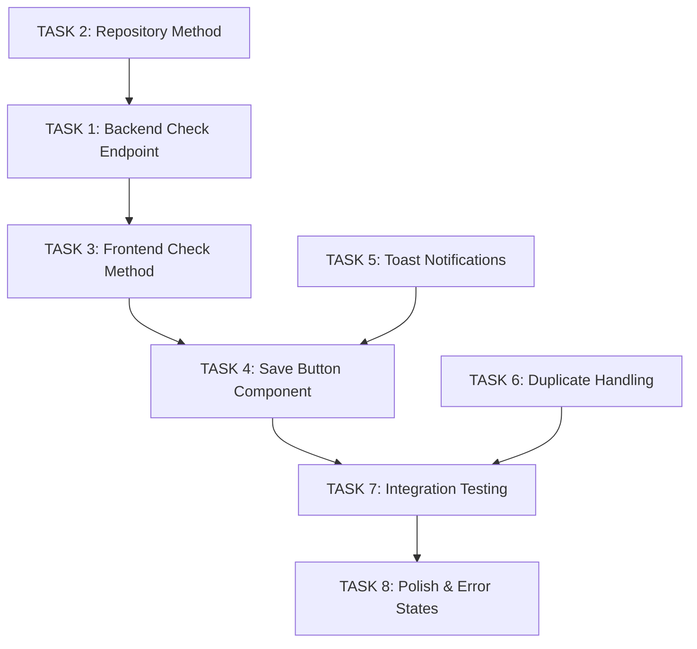

# L4 Tasks: Save Job Results to Gallery from Animation Studio

**Parent Feature**: Save Job Results to Gallery from Animation Studio (L3)
**Epic**: Creature Management System (L2)
**Status**: Ready for Implementation
**Created**: 2025-10-26

## Task Breakdown Summary

Total Tasks: 8
Estimated Time: 8-12 hours
Complexity: Medium

## Implementation Order

```
Phase 1: Backend Check (Tasks 1-2)
  └─> Phase 2: Frontend UI (Tasks 3-5)
      └─> Phase 3: Integration (Tasks 6-7)
          └─> Phase 4: Polish (Task 8)
```

---

## TASK 1: Add Backend Endpoint - Check if Job is Saved

**ID**: `TASK-SJRG-1`
**Type**: Backend API
**Priority**: High
**Estimated Time**: 1 hour
**Dependencies**: None

### Description
Create a backend endpoint to check if a generation job has already been saved to the gallery.

### Acceptance Criteria
- [ ] Endpoint: `GET /api/creature-library/check-saved/:jobId`
- [ ] Returns: `{ saved: boolean, creatureId?: string }`
- [ ] If saved, returns the existing creature ID
- [ ] If not saved, returns `{ saved: false }`
- [ ] Returns 404 if job doesn't exist
- [ ] Returns 400 if job is still processing

### Implementation Details

**File**: `/backend/src/api/routes/creatures.routes.ts`

```typescript
router.get('/check-saved/:jobId', async (req: Request, res: Response) => {
  const jobId = req.params['jobId'];
  const repository = getCreatureRepository();

  // Query Firestore for creature with matching generationJobId
  const creature = await repository.findByJobId(jobId);

  if (creature) {
    return res.json({ saved: true, creatureId: creature.id });
  }

  return res.json({ saved: false });
});
```

**New Repository Method**: `findByJobId(jobId: string): Promise<CreatureDocument | null>`

### Test Cases

**Unit Tests** (`creatures.routes.test.ts`):
1. ✓ Returns `{ saved: true, creatureId }` for saved job
2. ✓ Returns `{ saved: false }` for unsaved job
3. ✓ Returns 404 for non-existent job
4. ✓ Returns 400 for processing job

**Integration Tests**:
1. ✓ End-to-end check with real Firestore query
2. ✓ Performance: < 100ms response time

---

## TASK 2: Add Repository Method - Find Creature by Job ID

**ID**: `TASK-SJRG-2`
**Type**: Backend Repository
**Priority**: High
**Estimated Time**: 30 minutes
**Dependencies**: None

### Description
Add repository method to query Firestore for creatures by generation job ID.

### Acceptance Criteria
- [ ] Method: `findByJobId(jobId: string): Promise<CreatureDocument | null>`
- [ ] Queries `creatures` collection where `generationJobId == jobId`
- [ ] Returns first match (should only be one)
- [ ] Returns null if not found
- [ ] Handles Firestore errors gracefully

### Implementation Details

**File**: `/backend/src/repositories/creature.repository.ts`

```typescript
async findByJobId(jobId: string): Promise<CreatureDocument | null> {
  try {
    const query = this.firestore
      .collection(COLLECTION_NAME)
      .where('generationJobId', '==', jobId)
      .limit(1);

    const snapshot = await query.get();

    if (snapshot.empty) {
      return null;
    }

    return this.snapshotToDocument(snapshot.docs[0]);
  } catch (error) {
    console.error(`[CreatureRepository] Error finding creature by job ${jobId}:`, error);
    throw new Error(`Failed to query creature by job ID: ${error instanceof Error ? error.message : 'Unknown error'}`);
  }
}
```

### Test Cases

**Unit Tests** (`creature.repository.test.ts`):
1. ✓ Returns creature document for existing job ID
2. ✓ Returns null for non-existent job ID
3. ✓ Throws error on Firestore failure
4. ✓ Handles malformed job IDs gracefully

---

## TASK 3: Add Frontend Service Method - Check Save Status

**ID**: `TASK-SJRG-3`
**Type**: Frontend Service
**Priority**: High
**Estimated Time**: 30 minutes
**Dependencies**: TASK-SJRG-1

### Description
Add method to frontend library service to check if a job has been saved.

### Acceptance Criteria
- [ ] Method: `checkJobSaved(jobId: string): Promise<{ saved: boolean, creatureId?: string }>`
- [ ] Calls `GET /api/creature-library/check-saved/${jobId}`
- [ ] Returns typed response
- [ ] Handles network errors
- [ ] Includes error logging

### Implementation Details

**File**: `/frontend/src/services/creatureLibraryService.ts`

```typescript
async checkJobSaved(jobId: string): Promise<{ saved: boolean; creatureId?: string }> {
  try {
    const response = await fetch(`${LIBRARY_API}/check-saved/${jobId}`);

    if (!response.ok) {
      throw new Error(`HTTP ${response.status}: ${response.statusText}`);
    }

    return await response.json();
  } catch (error) {
    console.error('[CreatureLibrary] Error checking job save status:', error);
    throw error;
  }
}
```

### Test Cases

**Unit Tests** (`creatureLibraryService.test.ts`):
1. ✓ Returns `{ saved: true, creatureId }` on success
2. ✓ Returns `{ saved: false }` on success
3. ✓ Throws error on 404 response
4. ✓ Throws error on network failure
5. ✓ Logs errors to console

---

## TASK 4: Add Save Button Component to Animation Studio

**ID**: `TASK-SJRG-4`
**Type**: Frontend Component
**Priority**: High
**Estimated Time**: 2 hours
**Dependencies**: TASK-SJRG-3

### Description
Add "Add to Gallery" button to Animation Studio top navigation bar with proper state management.

### Acceptance Criteria
- [ ] Button appears in top nav bar
- [ ] Shows "Add to Gallery" when unsaved
- [ ] Shows "Saved ✓" when already saved
- [ ] Shows "Saving..." during save operation
- [ ] Disabled when already saved or saving
- [ ] Only visible when viewing job results (not when loading)

### Implementation Details

**File**: `/frontend/src/pages/CreatureAnimationStudio.tsx`

```typescript
// Add state
const [saveStatus, setSaveStatus] = useState<'unsaved' | 'saving' | 'saved'>('unsaved');
const [creatureId, setCreatureId] = useState<string | null>(null);

// Check save status on mount
useEffect(() => {
  if (jobId) {
    libraryService.checkJobSaved(jobId)
      .then(result => {
        if (result.saved) {
          setSaveStatus('saved');
          setCreatureId(result.creatureId || null);
        }
      })
      .catch(err => console.error('Failed to check save status:', err));
  }
}, [jobId]);

// Save handler
const handleSave = async () => {
  if (!jobId) return;

  setSaveStatus('saving');
  try {
    const result = await libraryService.saveCreature({
      jobId,
      ownerId: 'demo-player1'
    });

    setSaveStatus('saved');
    setCreatureId(result.creatureId);
    showNotification('success', `Creature saved! ID: ${result.creatureId}`);
  } catch (error) {
    setSaveStatus('unsaved');
    showNotification('error', 'Failed to save creature');
  }
};

// Render button in nav
<button
  onClick={handleSave}
  disabled={saveStatus !== 'unsaved'}
  className={saveStatus === 'saved' ? 'success' : ''}
>
  {saveStatus === 'unsaved' && 'Add to Gallery'}
  {saveStatus === 'saving' && 'Saving...'}
  {saveStatus === 'saved' && 'Saved ✓'}
</button>
```

### Test Cases

**Component Tests** (`CreatureAnimationStudio.test.tsx`):
1. ✓ Button renders with correct text when unsaved
2. ✓ Button disabled when already saved
3. ✓ Button shows "Saving..." during save
4. ✓ Button shows "Saved ✓" after successful save
5. ✓ Button re-enables on save failure
6. ✓ Check save status called on mount with jobId

---

## TASK 5: Add Toast Notification System

**ID**: `TASK-SJRG-5`
**Type**: Frontend Utility
**Priority**: Medium
**Estimated Time**: 1 hour
**Dependencies**: None

### Description
Create a simple toast notification system for success/error messages.

### Acceptance Criteria
- [ ] Function: `showNotification(type: 'success' | 'error', message: string)`
- [ ] Displays toast in top-right corner
- [ ] Auto-dismisses after 3 seconds
- [ ] Stacks multiple notifications
- [ ] Animated entrance/exit
- [ ] Accessible (ARIA labels)

### Implementation Details

**File**: `/frontend/src/utils/notifications.ts`

```typescript
export type NotificationType = 'success' | 'error' | 'info';

export interface Notification {
  id: string;
  type: NotificationType;
  message: string;
  timestamp: number;
}

let notifications: Notification[] = [];
let listeners: Array<(notifications: Notification[]) => void> = [];

export function showNotification(type: NotificationType, message: string): void {
  const notification: Notification = {
    id: `${Date.now()}-${Math.random()}`,
    type,
    message,
    timestamp: Date.now()
  };

  notifications = [...notifications, notification];
  notifyListeners();

  // Auto-dismiss after 3 seconds
  setTimeout(() => {
    removeNotification(notification.id);
  }, 3000);
}

export function removeNotification(id: string): void {
  notifications = notifications.filter(n => n.id !== id);
  notifyListeners();
}

export function subscribe(callback: (notifications: Notification[]) => void): () => void {
  listeners.push(callback);
  return () => {
    listeners = listeners.filter(l => l !== callback);
  };
}

function notifyListeners(): void {
  listeners.forEach(listener => listener(notifications));
}
```

**Component**: `/frontend/src/components/NotificationContainer.tsx`

### Test Cases

**Unit Tests** (`notifications.test.ts`):
1. ✓ Creates notification with unique ID
2. ✓ Auto-removes after 3 seconds
3. ✓ Notifies subscribers on add
4. ✓ Notifies subscribers on remove
5. ✓ Unsubscribe works correctly

---

## TASK 6: Handle Duplicate Save Gracefully

**ID**: `TASK-SJRG-6`
**Type**: Backend Logic
**Priority**: Medium
**Estimated Time**: 1 hour
**Dependencies**: TASK-SJRG-1, TASK-SJRG-2

### Description
Modify save endpoint to check for duplicates and return existing creature ID instead of creating a new one.

### Acceptance Criteria
- [ ] Check if job already saved before creating new creature
- [ ] If duplicate, return existing creature with `alreadyExists: true` flag
- [ ] Log duplicate attempt (for analytics)
- [ ] Don't throw error on duplicate (graceful handling)
- [ ] Return same response structure as new save

### Implementation Details

**File**: `/backend/src/api/routes/creatures.routes.ts` (Modify existing save endpoint)

```typescript
// Before creating creature, check if already saved
const repository = getCreatureRepository();
const existingCreature = await repository.findByJobId(jobId);

if (existingCreature) {
  console.log(`[Creatures API] Job ${jobId} already saved as creature ${existingCreature.id}`);
  return res.json({
    success: true,
    creatureId: existingCreature.id,
    creature: serializeCreature(existingCreature),
    alreadyExists: true
  });
}

// Proceed with normal save...
```

### Test Cases

**Integration Tests** (`creatures.routes.test.ts`):
1. ✓ Returns existing creature on duplicate save
2. ✓ Sets `alreadyExists: true` flag
3. ✓ Doesn't create new Firestore document
4. ✓ Logs duplicate attempt

---

## TASK 7: Integration Testing - Full Save Flow

**ID**: `TASK-SJRG-7`
**Type**: Integration Testing
**Priority**: High
**Estimated Time**: 2 hours
**Dependencies**: TASK-SJRG-1 through TASK-SJRG-6

### Description
End-to-end testing of the complete save flow from Animation Studio to gallery.

### Acceptance Criteria
- [ ] User can save unsaved job from Animation Studio
- [ ] Creature appears in gallery after save
- [ ] Button updates to "Saved ✓" after save
- [ ] Duplicate saves handled gracefully
- [ ] Network errors show appropriate message
- [ ] Refresh preserves save status

### Test Scenarios

**E2E Tests** (`animation-studio-save.e2e.test.ts`):

1. **Happy Path - First Save**
   - Load Animation Studio with unsaved job
   - Verify "Add to Gallery" button visible
   - Click button
   - Verify "Saving..." state
   - Wait for success notification
   - Verify button shows "Saved ✓"
   - Navigate to gallery
   - Verify creature appears in gallery

2. **Duplicate Save**
   - Load Animation Studio with already-saved job
   - Verify button shows "Saved ✓"
   - Verify button is disabled
   - Refresh page
   - Verify status persists

3. **Error Handling**
   - Mock save API to return 500 error
   - Click save button
   - Verify error notification
   - Verify button returns to "Add to Gallery"
   - Verify retry works

4. **Network Offline**
   - Go offline
   - Click save button
   - Verify "No internet connection" error
   - Go online
   - Verify retry works

### Implementation Details

Use Playwright or Cypress for E2E testing.

---

## TASK 8: Add Loading Skeletons and Error States

**ID**: `TASK-SJRG-8`
**Type**: Frontend Polish
**Priority**: Low
**Estimated Time**: 1 hour
**Dependencies**: TASK-SJRG-4

### Description
Add loading skeletons and comprehensive error states for better UX.

### Acceptance Criteria
- [ ] Show skeleton loader while checking save status
- [ ] Show specific error messages:
  - "Generation not found"
  - "Generation still processing"
  - "Network error - please retry"
  - "Failed to save creature"
- [ ] Add retry button for network errors
- [ ] Add tooltips explaining button states

### Implementation Details

**Error Messages**:
```typescript
const ERROR_MESSAGES = {
  JOB_NOT_FOUND: 'This generation could not be found',
  JOB_PROCESSING: 'Generation is still processing. Please wait.',
  NETWORK_ERROR: 'Connection failed. Please check your internet.',
  SAVE_FAILED: 'Failed to save creature. Please try again.',
  UNKNOWN: 'An unexpected error occurred'
};
```

**Skeleton Loader**: Use CSS animation for button shimmer while checking status

### Test Cases

**Visual Tests**:
1. ✓ Skeleton shown during status check
2. ✓ Error messages display correctly
3. ✓ Retry button works
4. ✓ Tooltips are accessible

---

## Task Dependencies Graph



## Test Coverage Requirements

- **Unit Tests**: 100% coverage for new service methods
- **Component Tests**: All UI states tested
- **Integration Tests**: Full save flow validated
- **E2E Tests**: User journey from Animation Studio to Gallery

## Definition of Done

For each task:
- [ ] Code implemented
- [ ] Unit tests pass (100% coverage)
- [ ] Integration tests pass
- [ ] Code reviewed
- [ ] Documentation updated
- [ ] No console errors
- [ ] Accessibility validated (WCAG 2.1 AA)

For the feature:
- [ ] All 8 tasks complete
- [ ] E2E tests pass
- [ ] Manual testing complete
- [ ] Product owner accepts

## Risk Assessment

**Low Risk**:
- Backend endpoint (simple query)
- Repository method (standard Firestore query)
- Frontend service method (API wrapper)

**Medium Risk**:
- Button state management (multiple states to handle)
- Duplicate save handling (edge case testing needed)

**High Risk**:
- None identified

## Next Steps

1. Review task breakdown with team
2. Assign tasks to developers
3. Begin implementation with TASK-SJRG-1 (backend foundation)
4. Implement in order: Backend → Frontend → Integration → Polish
